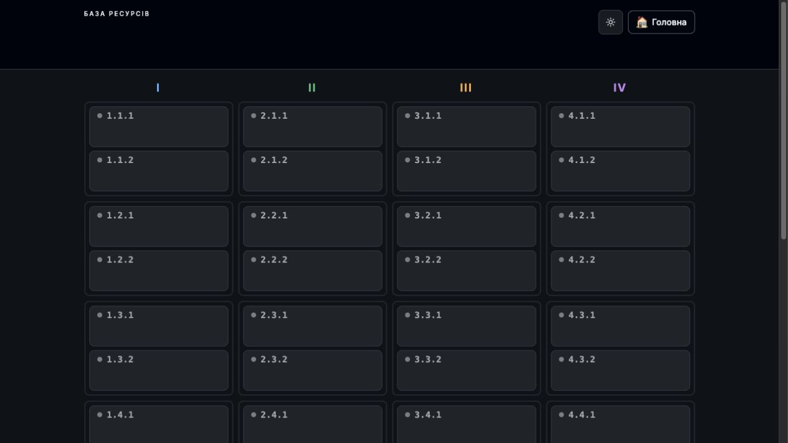
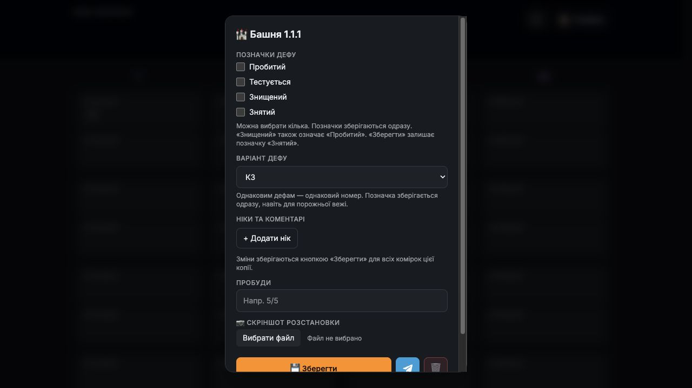
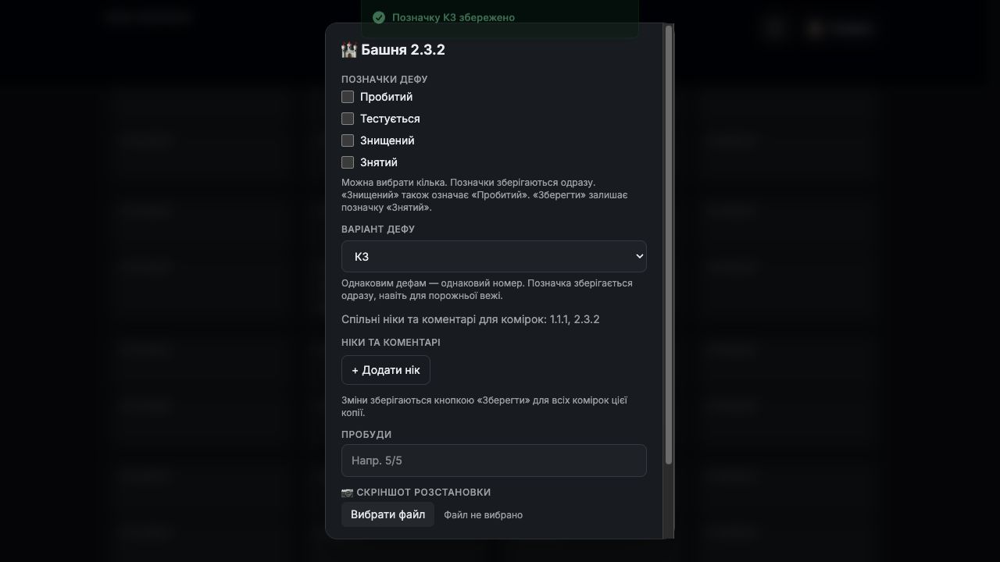
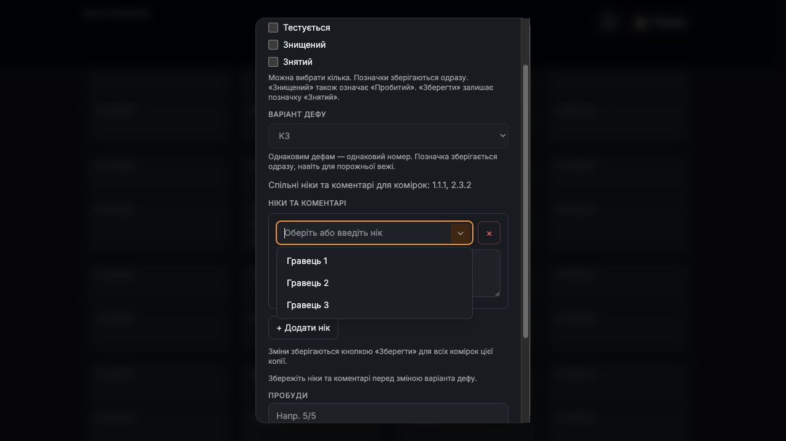
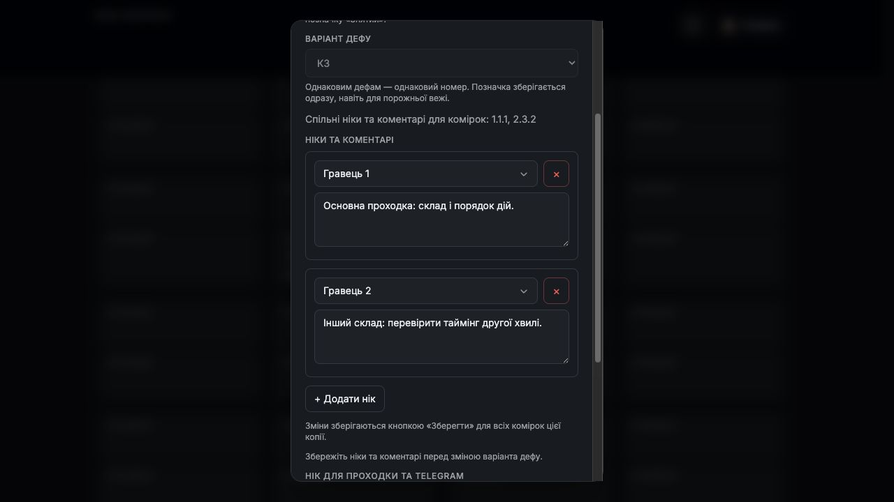
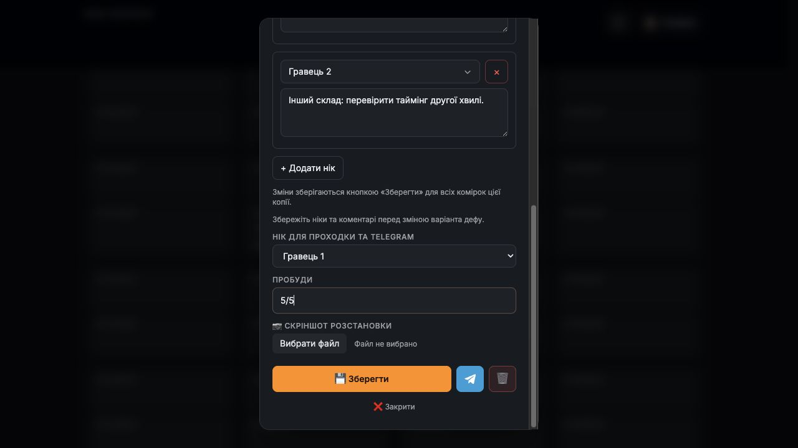
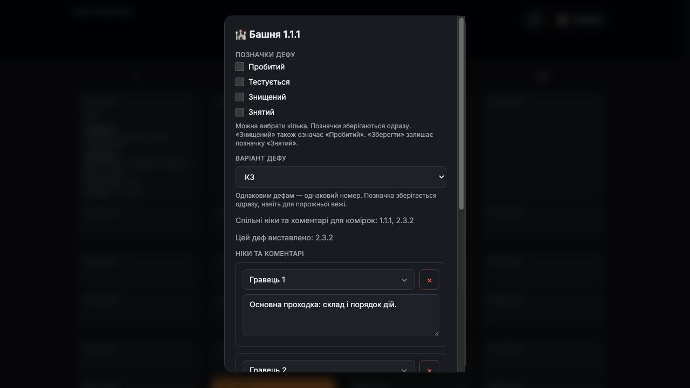
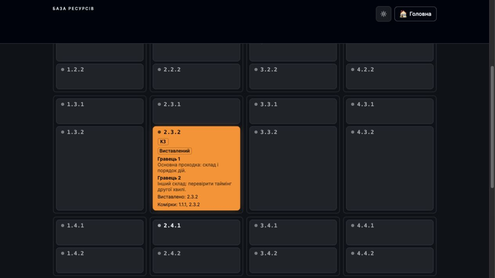

# Як додати виставлений деф і об’єднати однакові

## Виставлений деф: покроково

Покажемо весь процес на двох комірках: 1.1.1 і 2.3.2. Вони отримають однаковий номер К3 та спільний список гравців. Виставимо лише 2.3.2.

1. Відкрийте потрібну комірку

На головній натисніть «Вежі». Виберіть позицію, яка відповідає дефу у грі. Номер відкритої комірки завжди видно в заголовку форми.

Приклад 1. Сітка веж до заповнення: обираємо 1.1.1.

Що буде спільним?

Ніки та коментарі для всіх комірок з одним номером К.

Що зберігається окремо?

Виставлення, прапорці статусів, пробуди та скріншот кожної комірки.

Знімки зроблено в ізольованій навчальній копії поточної локальної версії. Ніки й дані прикладів демонстраційні. На опублікованому сайті інтерфейс може відрізнятися до розгортання змін і міграції.

## Однакові дефи → однаковий К

2. Призначте К3 першій і другій копії

У 1.1.1 виберіть «Варіант дефу» → К3. Закрийте форму, відкрийте 2.3.2 і теж виберіть К3. Номер обирайте за фактично однаковим дефом; доступні К1-К25.

Приклад 2. У комірці 1.1.1 обрано К3.

Приклад 3. У 2.3.2 теж К3: форма показує обидві спільні комірки.

3. Перевірте, що комірки об’єдналися

Знайдіть рядок «Спільні ніки та коментарі для комірок: 1.1.1, 2.3.2». Саме він підтверджує склад групи.

Номер К зберігається одразу, навіть для порожньої комірки. Він не виставляє деф автоматично. «Без позначки» залишає комірку поза групою.

## Два гравці, два коментарі

4. Додайте учасників у комірці 2.3.2

Натисніть «+ Додати нік». Виберіть гравця зі списку або введіть нік вручну. У полі нижче запишіть його склад, стратегію чи таймінг. Повторіть для другого гравця.

Приклад 4. Вибір ніку зі списку. Також можна вводити нік вручну.

Приклад 5. Два ніки з окремими коментарями в одній групі К3.

Не перезаписуйте чужий коментар своїм

Додайте окремий рядок для свого ніку. Кнопка × видаляє рядок зі списку; після «Зберегти» ця зміна стосується всієї групи.

Порожній рядок заповніть або видаліть. Після редагування ніків чи коментарів поле К заблоковане до натискання «Зберегти».

## Збереження та перевірка копії

5. Заповніть дані 2.3.2 і натисніть «Зберегти»

Вкажіть пробуди. Через «Вибрати файл» додайте свій скріншот розстановки. Якщо ніків кілька, оберіть «Нік для проходки та Telegram». У прикладі пробуди - 5/5; файл не додавався.

Приклад 6. Пробуди, вибір файлу та кнопка «Зберегти».

Приклад 7. Відкрили 1.1.1: видно спільну групу та «Цей деф виставлено: 2.3.2».

6. Відкрийте іншу комірку цієї групи

Після збереження 2.3.2 відкрийте 1.1.1. Спільні ніки й коментарі вже доступні там. Її власні пробуди та скріншот не копіюються з 2.3.2.

Прапорці «Пробитий», «Тестується», «Знищений», «Знятий» зберігаються одразу для відкритої комірки. Для повторного виставлення знятого дефу використайте «Виставити знову».

## Як виглядає готовий результат

7. Перевірте позначку «Виставлений»

Після збереження комірка 2.3.2 показує К3, позначку «Виставлений», обидва ніки з коментарями та список пов’язаних комірок.

Приклад 8. Збережена 2.3.2: видно К3, учасників і «Виставлено: 2.3.2».

Чому 1.1.1 ще не виставлена?

Однаковий К об’єднує інформацію про гравців, але не змінює місце фактичного виставлення. Для цієї навчальної групи виставлена лише 2.3.2.

Як виставити й другу копію?

Коли деф справді виставлено у 1.1.1, відкрийте її, заповніть власні дані розстановки та натисніть «Зберегти». Після успіху перевірте її позначку та оновлений список виставлених копій.

Коротко: вибрати комірку → задати спільний К → додати ніки й коментарі → заповнити дані комірки → зберегти → перевірити, де деф виставлено.

