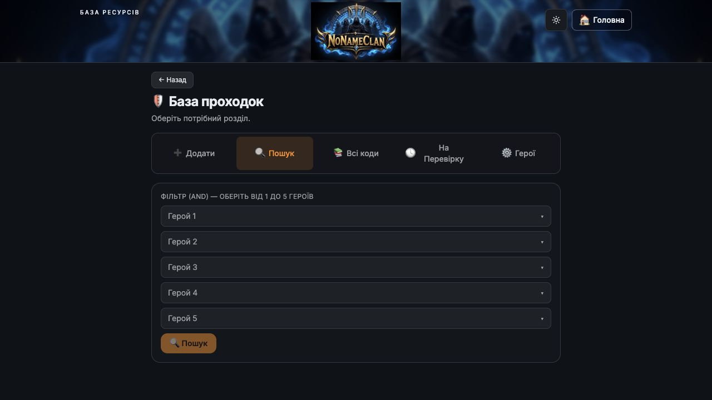

# Як знайти проходку

**Шлях:** Проходки → База проходок → Пошук

[Відкрити розділ](https://unlimited-tests.lovable.app/defenses)

1. **Відкрийте пошук.** На головній оберіть «Проходки», далі «База проходок» і вкладку «🔍 Пошук».
2. **Оберіть героїв дефу.** Натисніть «Герой 1» і виберіть потрібного героя. За потреби додайте інших: усього можна вибрати від 1 до 5.
3. **Запустіть пошук.** Натисніть нижню кнопку «🔍 Пошук». У результатах будуть записи, що містять усіх вибраних героїв одночасно.
4. **Перегляньте знайдені записи.** Звірте склад, скріншот, код проходки та коментар. Зверніть увагу на гравця, його БС і рівні мобів, якщо ці дані заповнені.
5. **Уточніть запит.** Якщо результатів немає, зменште кількість вибраних героїв і повторіть пошук. «Очистити фільтр» скидає вибір; «Всі коди» показує загальний список.

**Підказка:** Менше героїв у фільтрі — ширший пошук. Більше героїв — точніший збіг. Запис може бути збережений без коду проходки.

Вкладка пошуку: п’ять полів героїв і кнопка запуску.

