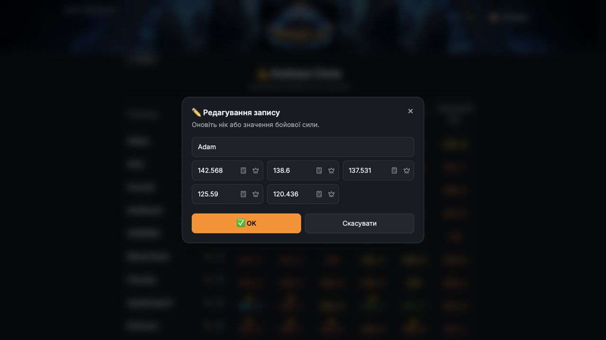

# Як змінити свій БС

**Шлях:** БС та моби → Бойова Сила

[Відкрити розділ](https://unlimited-tests.lovable.app/battle-power)

1. **Перейдіть до бойової сили.** На головній відкрийте «БС та моби», потім «Бойова Сила».
2. **Відкрийте свій запис.** Знайдіть власний нік у таблиці й натисніть олівець поруч. Якщо сайт уже пам’ятає ваш нік, можна натиснути «Редагувати свій БС». Якщо запису ще немає — «Додати свій БС».
3. **Оновіть значення.** Перевірте нік і введіть актуальні значення в поля БС 1–5. Використовуйте той самий масштаб, що в таблиці, наприклад 142.6.
4. **Перевірте позначку пробуди.** Значок корони позначає значення з пробудою. За потреби скористайтеся калькулятором біля відповідного поля.
5. **Підтвердьте зміни.** Натисніть «✅ OK». Перевірте оновлені значення у своєму рядку таблиці.

**Підказка:** На скріншоті відкрито запис Adam лише як приклад форми. Для своїх змін обирайте власний нік.

Форма редагування БС: нік, п’ять значень і кнопка OK.

