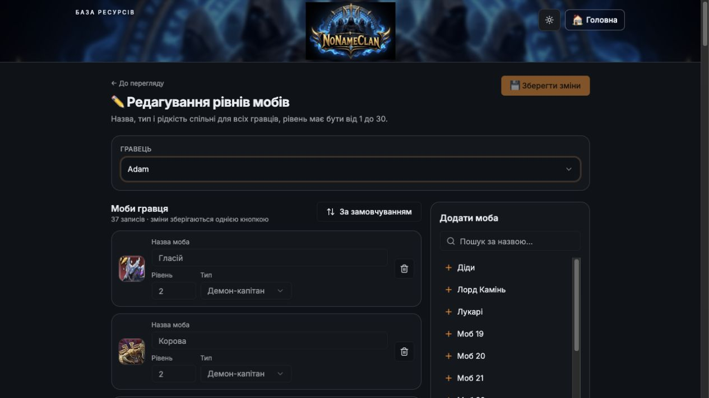

# Як змінити рівні своїх мобів

**Шлях:** БС та моби → Рівні мобів

[Відкрити розділ](https://unlimited-tests.lovable.app/mob-levels)

1. **Відкрийте рівні мобів.** На головній оберіть «БС та моби», потім «Рівні мобів».
2. **Виберіть себе.** У полі «Гравець» оберіть свій нік. Натисніть «✏️ Редагувати рівні» та перевірте вибраного гравця.
3. **Змініть рівні.** У потрібних картках змініть поле «Рівень». Допустимі лише цілі числа від 1 до 30.
4. **Додайте відсутнього моба.** Якщо моба немає у вашому списку, знайдіть його в блоці «Додати моба» й натисніть назву. Новий моб додається з рівнем 1 — встановіть актуальний рівень.
5. **Збережіть усі зміни.** Натисніть «💾 Зберегти зміни» вгорі. Дочекайтеся повідомлення про успішне збереження; через «До перегляду» перевірте результат.

**Підказка:** Для оновлення власних рівнів змінюйте поле «Рівень». Назва, тип і рідкість моба спільні для всіх гравців. Якщо вашого ніку немає у списку, спочатку додайте свій запис на сторінці БС.

Приклад редактора: гравець, поля рівнів, додавання моба й збереження.

